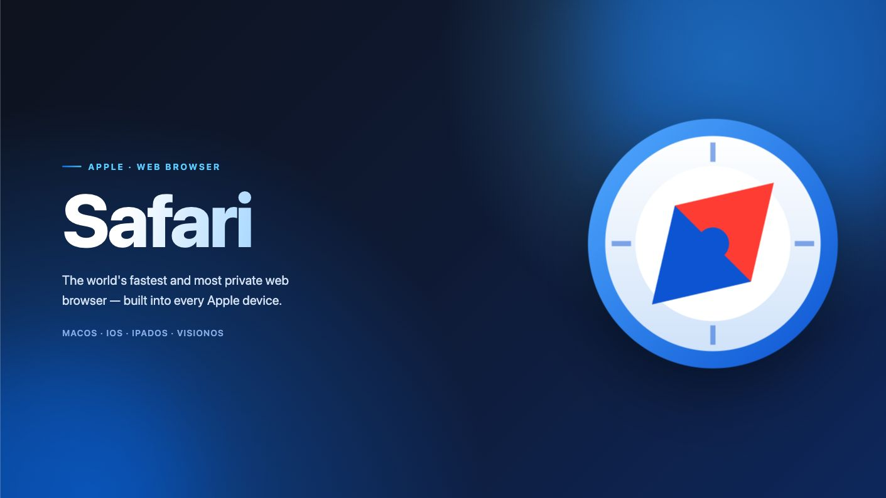
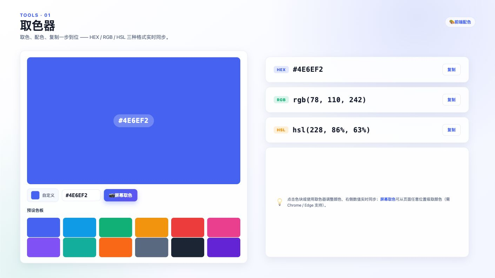

# hpTry — Built for a New Presentation Format

[简体中文](./README.md) | **English**

hpTry is a browser-based AI presentation workspace. Through conversation, you can ask an Agent to create, modify, and debug HTML-based slides while previewing the result, managing project files, and importing or exporting `.hp` projects in the same interface.

Project data is stored locally in the browser, with no application backend required.

## Online Demos

<table>
  <tr>
    <td>
      <a href="https://s.hptry.com/demo/3d-model">
        
      </a>
    </td>
    <td>
      <a href="https://s.hptry.com/demo/safari">
        
      </a>
    </td>
    <td>
      <a href="https://s.hptry.com/demo/tools">
        
      </a>
    </td>
  </tr>
</table>

## Features

- Preview generated presentations in real time, with a slide list, canvas aspect-ratio controls, and fullscreen viewing
- Let the Web Agent read, search, create, edit, rename, and delete workspace files
- Manage multiple projects and conversations while retaining messages and tool-call history
- Connect to OpenAI Chat Completions-compatible model APIs with streaming responses
- Use the built-in DeepSeek provider configuration or add a custom API endpoint and model
- Import and export `.hp` projects
- Store projects, conversations, providers, and workspace files locally with IndexedDB

## The `.hp` Project Format

A `.hp` file is a ZIP archive containing the presentation project's text files and binary assets. Temporary uploads under `.tmp/` are excluded when exporting a project.

A basic presentation project typically contains:

```text
manifest.json
hp.html
main.js
runtime/
├── runtime.css
└── vue.esm-browser.prod.js
slides/
└── slide-001.js
styles/
└── style.css
```

- `hp.html` is the preview entry point.
- `manifest.json` defines the canvas size, keyboard navigation, and slide order.
- Each `slides/slide-xxx.js` file represents one slide and exports a Vue component by default.
- `assets/` can store images, fonts, audio, video, and other static assets.
- `styles/` and `scripts/` can store styles and scripts shared across slides.

## Quick Start

### Requirements

- Node.js (the current LTS release is recommended)
- npm
- A modern browser with support for IndexedDB, Service Worker, and ES Module

### Install and Run

```bash
npm ci
cp .env.example .env
npm run dev
```

After the development servers start, open:

- Main application: <http://127.0.0.1:5111>
- Preview service: <http://127.0.0.1:5112>

`npm run dev` starts both the main application and the preview service. Live preview requires both services to be running.

### Configure a Model

1. Open the main application.
2. Open the provider settings.
3. Enter the API endpoint, API Key, and model name.
4. Select **Test Connection**, then save the provider after the test succeeds.
5. Create a project and conversation, then describe the presentation you want to create or modify.

> The API Key is stored in IndexedDB in the current browser. Only use it on trusted devices and trusted deployments. Do not save production keys on public or shared devices.

## Environment Variables

| Variable | Default | Description |
| --- | --- | --- |
| `VITE_PREVIEW_ORIGIN` | `http://127.0.0.1:5112` | Origin of the standalone preview service |

If you change the preview service's domain, protocol, or port, update this variable accordingly. The main application and preview service exchange workspace resources through an origin-validated `postMessage` channel.

## Available Commands

| Command | Description |
| --- | --- |
| `npm run dev` | Start the development servers for the main application and preview service |
| `npm run build` | Run type checking and build the main application and preview service |
| `npm run preview` | Preview both production builds locally |

The build outputs are written to `dist/` and `dist-preview/`. In production, host both outputs separately and set `VITE_PREVIEW_ORIGIN` to the public origin of the preview site.

## License

[MIT](./LICENSE) © 2026 confusionWill
